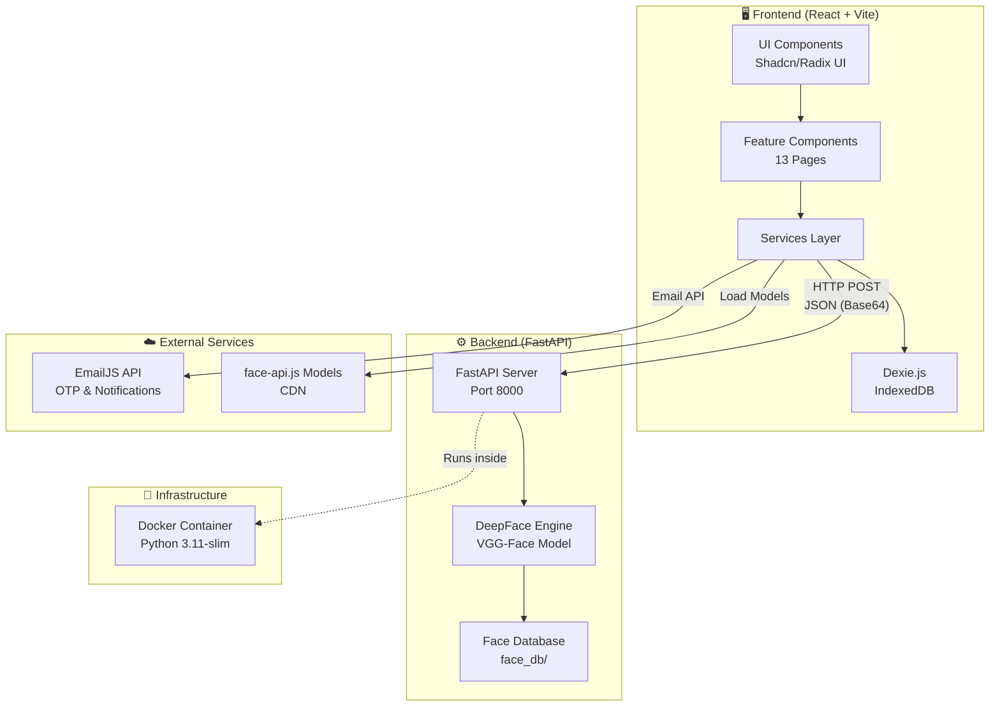
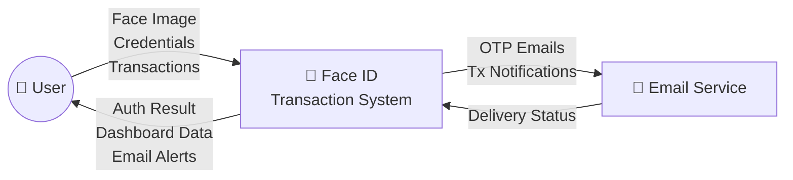
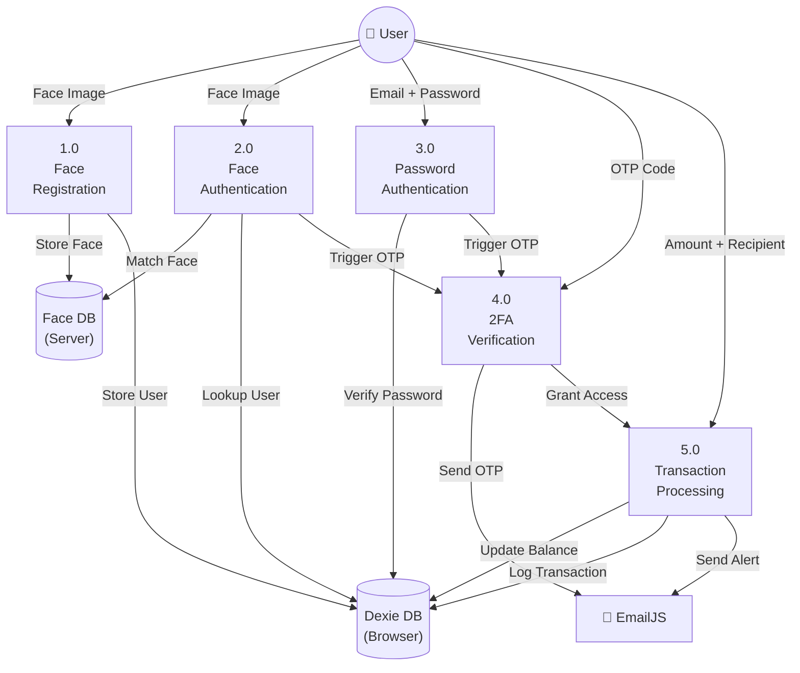
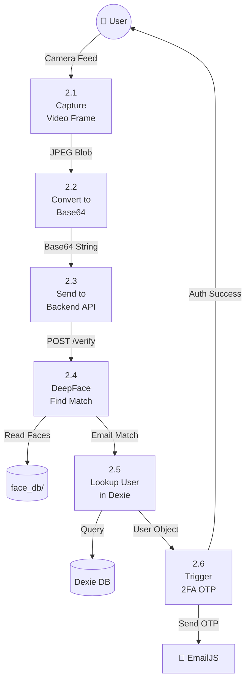
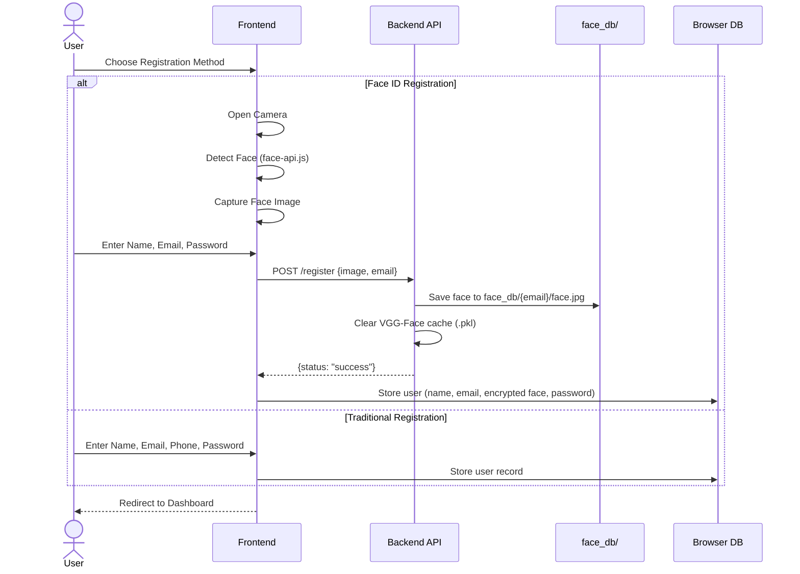
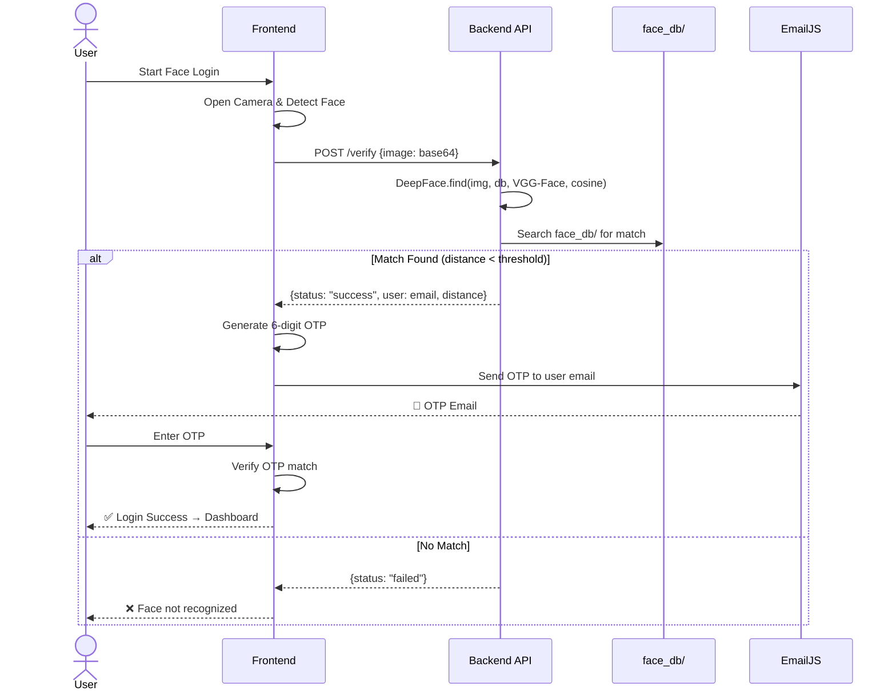
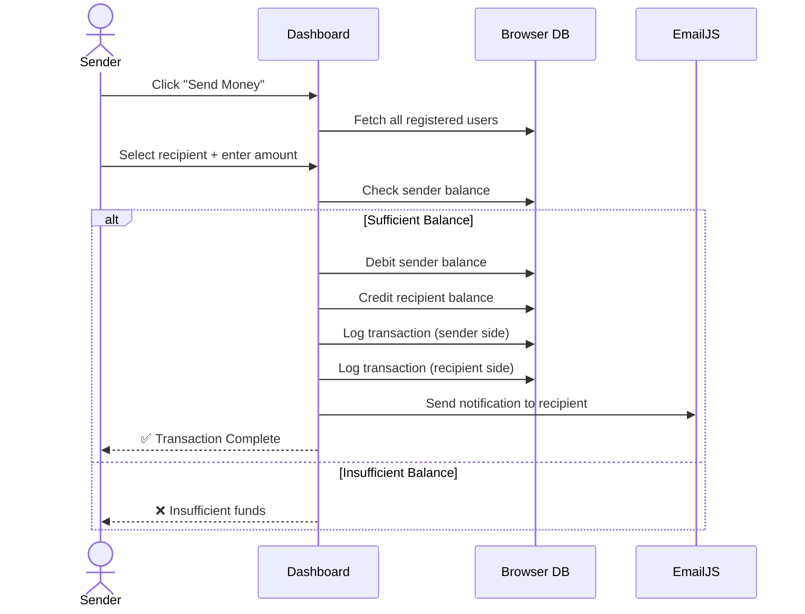
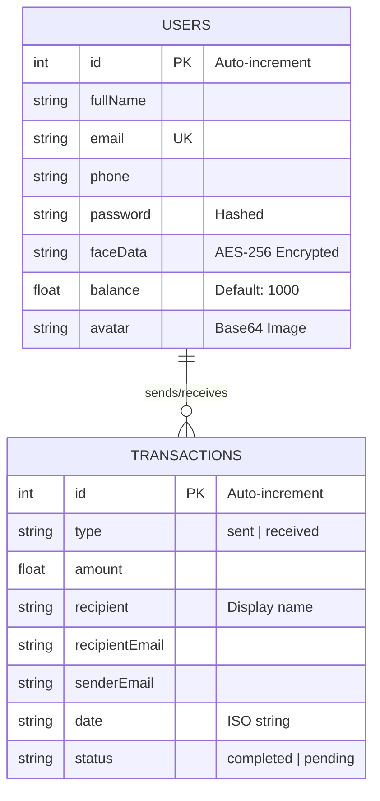
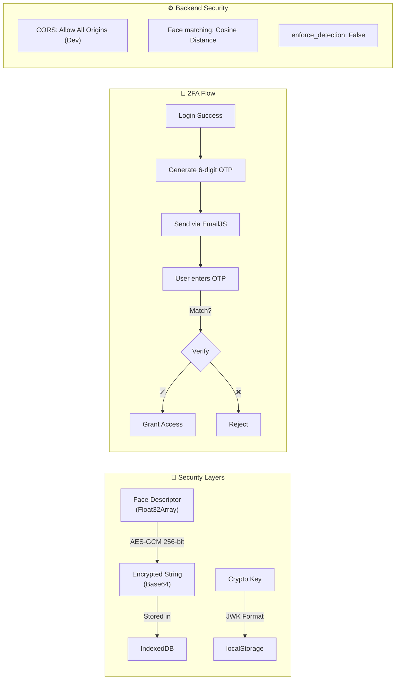

<p align="center">
  <h1 align="center">🔐 Face ID Transaction Website</h1>
  <p align="center">
    A modern, secure biometric authentication and digital wallet system powered by DeepFace AI
  </p>
</p>

<p align="center">
  
  
  
  
  
  
</p>

---

## ✨ Features

| Feature | Description |
|---------|-------------|
| 🧬 **Face ID Authentication** | AI-powered biometric login using DeepFace (VGG-Face model) |
| 🔑 **Two-Factor Auth (2FA)** | Email OTP verification after every login for extra security |
| 📝 **Unified Registration** | Register face biometrics and password simultaneously |
| 🔓 **Password Fallback** | Alternative login when Face ID is unavailable |
| 💸 **Send & Receive Money** | Peer-to-peer transactions with real-time balance updates |
| 📊 **Interactive Dashboard** | View logins, flagged attempts, balance, and session details |
| 📧 **Email Notifications** | Transaction alerts and OTP codes via EmailJS |
| 🔒 **AES-256 Encryption** | Face descriptors encrypted with AES-GCM before storage |
| 📱 **Responsive Design** | Optimized for mobile and desktop with Framer Motion animations |

---

## 🏗️ System Architecture



---

## 📊 Data Flow Diagrams

### DFD Level 0 — Context Diagram



### DFD Level 1 — Major Processes



### DFD Level 2 — Face Authentication Detail



---

## 🔄 Application Flow

### User Registration Flow



### Login & 2FA Flow



### Transaction Flow



---

## 🗄️ Database Schema

### Backend — Face Database (File System)

```
face_db/
├── user1@email.com/
│   └── face.jpg
├── user2@email.com/
│   └── face.jpg
└── representations_vgg_face.pkl   ← Auto-generated cache
```

### Frontend — Dexie (IndexedDB) Schema



---

## 🔒 Security Architecture



---

## 🛠️ Tech Stack

### Frontend
| Technology | Purpose |
|-----------|---------|
| [React 18.3](https://react.dev/) | UI Framework |
| [Vite 6.3](https://vitejs.dev/) | Build tool & dev server |
| [TailwindCSS 4.1](https://tailwindcss.com/) | Utility-first CSS |
| [Framer Motion](https://www.framer.com/motion/) | Animations & transitions |
| [Shadcn UI](https://ui.shadcn.com/) + [Radix UI](https://www.radix-ui.com/) | 48 accessible UI components |
| [Lucide React](https://lucide.dev/) | Icon library |
| [Dexie.js](https://dexie.org/) | IndexedDB wrapper (client-side DB) |
| [face-api.js](https://github.com/justadudewhohacks/face-api.js) | Browser face detection |
| [EmailJS](https://www.emailjs.com/) | Email OTP & notifications |
| Web Crypto API | AES-GCM encryption |

### Backend
| Technology | Purpose |
|-----------|---------|
| [FastAPI](https://fastapi.tiangolo.com/) | Python web framework |
| [Uvicorn](https://www.uvicorn.org/) | ASGI server |
| [DeepFace](https://github.com/serengil/deepface) | Face recognition (VGG-Face) |
| [OpenCV](https://opencv.org/) | Image processing |
| [TensorFlow](https://www.tensorflow.org/) | ML backend for DeepFace |
| [Docker](https://www.docker.com/) | Containerization |

---

## 📁 Project Structure

```
face_login/
├── index.html                    # Entry point
├── vite.config.ts                # Vite config (React + Tailwind)
├── package.json                  # Frontend dependencies
├── tsconfig.json                 # TypeScript config
├── postcss.config.mjs            # PostCSS config
│
├── src/
│   ├── main.tsx                  # React root render
│   ├── db.ts                     # Dexie database (Users + Transactions)
│   │
│   ├── services/
│   │   ├── faceService.ts        # Face detection + backend API calls
│   │   ├── emailService.ts       # EmailJS OTP & notifications
│   │   └── encryptionService.ts  # AES-GCM encryption for face data
│   │
│   ├── app/
│   │   ├── App.tsx               # Main app (state machine, 9 states)
│   │   └── components/
│   │       ├── FaceAuth.tsx           # Face ID login screen
│   │       ├── FaceRegistration.tsx   # Face capture for registration
│   │       ├── FaceRegistrationInfo.tsx # User info after face capture
│   │       ├── PasswordLogin.tsx      # Email + password login
│   │       ├── ForgotPassword.tsx     # Password reset flow
│   │       ├── OTPVerification.tsx    # 2FA OTP input screen
│   │       ├── RegistrationStart.tsx  # Choose registration method
│   │       ├── TraditionalRegistration.tsx # Non-face registration
│   │       ├── Registration.tsx       # Base registration types
│   │       ├── Dashboard.tsx          # Main dashboard
│   │       ├── SendMoney.tsx          # Send money flow
│   │       ├── ReceiveMoney.tsx       # Receive / QR display
│   │       ├── TransactionHistory.tsx # Transaction list
│   │       └── ui/                    # 48 Shadcn UI components
│   │
│   └── styles/
│       ├── index.css             # Root styles
│       ├── tailwind.css          # Tailwind imports
│       ├── theme.css             # Custom theme tokens
│       └── fonts.css             # Font configuration
│
├── backend/
│   ├── main.py                   # FastAPI server (/verify, /register)
│   ├── requirements.txt          # Python dependencies
│   ├── Dockerfile                # Backend container
│   ├── docker-compose.yml        # Backend-only Docker setup
│   ├── .dockerignore             # Excludes venv, cache
│   └── face_db/                  # Stored face images per user
│
├── start.bat                     # ⚡ One-click start (Windows)
├── start.sh                      # ⚡ One-click start (macOS/Linux)
├── Dockerfile                    # Frontend container
├── docker-compose.yml            # Full-stack Docker setup
├── .dockerignore                 # Root Docker ignore
├── docs/                         # Documentation
└── public/                       # Static assets
```

---

## 🚀 Quick Start

### Option 1: One-Click Script ⚡ (Easiest)

> **Requires:** [Docker Desktop](https://www.docker.com/products/docker-desktop/) + [Node.js](https://nodejs.org/) v16+

**Windows** — Double-click `start.bat`

**macOS / Linux:**
```bash
chmod +x start.sh
./start.sh
```

That's it! The script automatically starts the backend (Docker) and frontend (npm).

---

### Option 2: Full Docker 🐳 (Zero Setup)

> **Requires:** [Docker Desktop](https://www.docker.com/products/docker-desktop/) only — no Node.js or Python needed!

```bash
git clone https://github.com/miran786/face_login.git
cd face_login
docker compose up --build
```

| Service | URL |
|---------|-----|
| Frontend | http://localhost:5173 |
| Backend API | http://localhost:8000 |

To stop: `Ctrl+C` or `docker compose down`

---

### Option 3: Manual Setup 🔧

#### Backend
```bash
cd backend
python -m venv venv
venv\Scripts\activate         # Windows
# source venv/bin/activate    # macOS/Linux
pip install -r requirements.txt
python main.py
```

> ⚠️ Requires **Python 3.10 or 3.11** (TensorFlow doesn't support 3.12+)

#### Frontend
```bash
# From root directory
npm install
npm run dev
```

---

## 🔌 API Endpoints

| Method | Endpoint | Body | Response |
|--------|----------|------|----------|
| `GET` | `/` | — | `{"status": "Face Recognition Server Running"}` |
| `POST` | `/verify` | `{"image": "<base64>"}` | `{"status": "success", "user": "email", "distance": 0.23}` |
| `POST` | `/register` | `{"image": "<base64>", "email": "user@mail.com"}` | `{"status": "success", "message": "User registered"}` |

---

## ⚙️ Configuration

| Variable | Location | Default | Description |
|----------|----------|---------|-------------|
| Backend URL | `src/services/faceService.ts` | `http://localhost:8000` | Change for cross-machine setup |
| EmailJS Service ID | `src/services/emailService.ts` | `service_du1h5i1` | Your EmailJS service |
| EmailJS Template ID | `src/services/emailService.ts` | `template_wg2bduq` | Your email template |
| EmailJS Public Key | `src/services/emailService.ts` | `5KrNj6cWERlaQuo5Z` | Your EmailJS public key |
| Face Model | `backend/main.py` | `VGG-Face` | DeepFace model (VGG-Face, Facenet, etc.) |
| Distance Metric | `backend/main.py` | `cosine` | Similarity metric |

---

## 📜 Attribution

Original design concept: [Figma](https://www.figma.com/design/ywfTlEqG9EdJ286MjBLA8x/Face-ID-Transaction-Website)