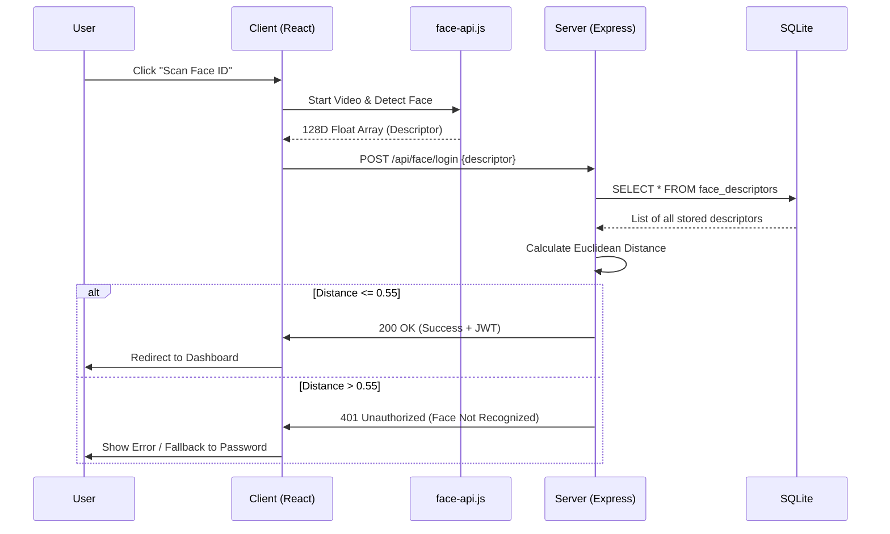
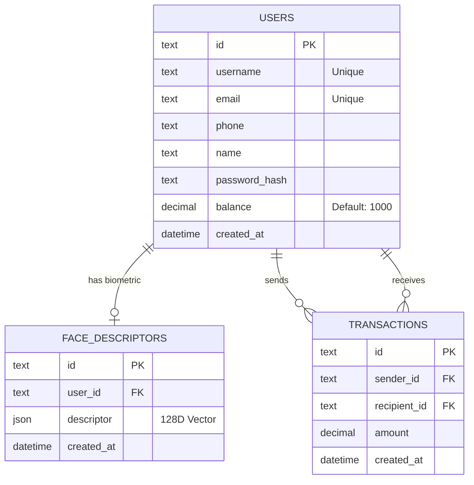

# FaceWallet

> A next-generation digital wallet secured by real-time AI face recognition — no passwords required.


---

## What is FaceWallet?

FaceWallet is a **biometric-first digital wallet** that authenticates users using their face via machine learning, eliminating the need to remember passwords. It combines a sleek React frontend with a Node.js backend and a real ML face recognition engine powered by `face-api.js`.

---

## Features

### Authentication
| Feature | Description |
|---|---|
| **Face ID Registration** | Capture and store a 128-dimensional face descriptor using your webcam |
| **Face ID Login** | Authenticate instantly by scanning your face — matched via Euclidean distance |
| **Password Registration** | Classic username + email + password sign-up with bcrypt hashing |
| **Password Login** | Traditional fallback login with JWT session management |
| **Session Persistence** | Automatically restores your session via HttpOnly cookie |
| **Secure Logout** | Clears server-side JWT cookie |

### Wallet
| Feature | Description |
|---|---|
| **Balance Dashboard** | View your current wallet balance with loading state and toggle to hide/show |
| **Send Money** | Transfer funds to other users with amount validation (2 decimal places) |
| **Receive Money** | Share a wallet address or QR code to receive payments |
| **Transaction History** | Browse your full list of sent and received transactions |

### Robustness
| Feature | Description |
|---|---|
| **Graceful Shutdown** | Server handles SIGTERM/SIGINT and closes DB connections cleanly |
| **DB Init Safety** | Server waits for database schema initialization before accepting requests |
| **Atomic Transfers** | Money transfers use atomic SQL updates to prevent double-spend race conditions |
| **Busy Timeout** | SQLite configured with 3s busy timeout to handle concurrent access |
| **Fetch Abort on Unmount** | Dashboard cancels in-flight requests when component unmounts |
| **Timer Cleanup** | All setTimeout calls are cleaned up on component unmount to prevent memory leaks |
| **Configurable API URL** | Backend URL extracted to `VITE_API_URL` env var (defaults to `localhost:5000`) |
| **Input Validation** | Face descriptors validated for finite numbers; transfer amounts sanitized |

---

## Architecture

```
face_login/
├── frontend/              # React + Vite + Tailwind CSS
│   └── src/
│       └── app/
│           ├── config.ts              # API_BASE URL configuration
│           ├── App.tsx                # App state machine (routing)
│           └── components/
│               ├── FaceAuth.tsx       # Face ID login flow
│               ├── FaceRegistration.tsx # Webcam face capture
│               ├── FaceRegistrationInfo.tsx # User info form (face)
│               ├── TraditionalLogin.tsx
│               ├── TraditionalRegistration.tsx
│               ├── Dashboard.tsx      # Wallet dashboard
│               ├── SendMoney.tsx
│               ├── ReceiveMoney.tsx
│               └── TransactionHistory.tsx
│
└── backend/               # Node.js + Express
    ├── server.js           # Entry point with graceful shutdown
    ├── routes/
    │   ├── auth.js         # /api/auth — login, logout, /me
    │   ├── register.js     # /api/register — user creation
    │   ├── face.js         # /api/face — face register + login
    │   ├── wallet.js       # /api/wallet — balance + history + transfer
    │   └── user.js         # /api/users — contacts list
    ├── middleware/
    │   └── auth.js         # JWT authentication middleware
    ├── db/
    │   ├── index.js        # SQLite connection with busyTimeout + init promise
    │   └── schema.sql      # users + face_descriptors + transactions tables
    ├── scripts/
    │   └── seed_mock_users.js # Seed test users for development
    ├── Dockerfile
    └── docker-compose.yml
```

---

## System Diagrams

### 1. Data Flow Diagram (DFD)


```mermaid
graph LR
    User([User])
    Webcam[Webcam/Video]
    ML_Model[face-api.js ML Engine]
    Frontend[React App]
    Backend[Node.js API]
    DB[(SQLite DB)]

    User -- "Positions Face" --> Webcam
    Webcam -- "Video Stream" --> ML_Model
    ML_Model -- "Detects & Extracts" --> Frontend
    Frontend -- "128D Descriptor" --> Backend
    Backend -- "Min Distance Match" --> DB
    Backend -- "JWT Session" --> Frontend
```

### 2. Face ID Authentication Sequence


```mermaid
sequenceDiagram
    participant U as User
    participant C as Client (React)
    participant ML as face-api.js
    participant S as Server (Express)
    participant DB as SQLite

    U->>C: Click "Scan Face ID"
    C->>ML: Start Video & Detect Face
    ML-->>C: 128D Float Array (Descriptor)
    C->>S: POST /api/face/login {descriptor}
    S->>DB: SELECT * FROM face_descriptors
    DB-->>S: List of all stored descriptors
    S->>S: Calculate Euclidean Distance
    alt Distance <= 0.55
        S->>C: 200 OK (Success + JWT)
        C->>U: Redirect to Dashboard
    else Distance > 0.55
        S->>C: 401 Unauthorized (Face Not Recognized)
        C->>U: Show Error / Fallback to Password
    end
```

### 3. Entity Relationship Diagram (ERD)


```mermaid
erDiagram
    USERS {
        text id PK
        text username "Unique"
        text email "Unique"
        text phone
        text name
        text password_hash
        decimal balance "Default: 1000"
        datetime created_at
    }
    FACE_DESCRIPTORS {
        text id PK
        text user_id FK
        json descriptor "128D Vector"
        datetime created_at
    }
    TRANSACTIONS {
        text id PK
        text sender_id FK
        text recipient_id FK
        decimal amount
        datetime created_at
    }
    USERS ||--o| FACE_DESCRIPTORS : "has biometric"
    USERS ||--o{ TRANSACTIONS : "sends"
    USERS ||--o{ TRANSACTIONS : "receives"
```

---

## How Face Recognition Works

1. **Registration**: The browser uses `face-api.js` to detect your face via webcam and computes a **128-dimensional face descriptor** (a floating-point vector unique to your face). Each value is validated to be a finite number.
2. **Storage**: The descriptor is sent to the backend and stored in the `face_descriptors` table linked to your user account.
3. **Login**: During authentication, a new descriptor is captured and compared against all stored descriptors using **Euclidean distance**.
4. **Match decision**: If the closest match has a distance <= `0.55` (configurable threshold), login succeeds and a JWT is issued.

> The SSD MobileNet v1 + FaceLandmark68Net + FaceRecognitionNet models are loaded from the `/models` directory in the frontend's public folder.

---

## Tech Stack

### Frontend
| Tech | Purpose |
|---|---|
| **React 18** + **Vite** | UI framework & build tool |
| **TypeScript** | Type safety |
| **Tailwind CSS v4** | Utility-first styling |
| **face-api.js** | Browser-based ML face detection & recognition |
| **Motion (Framer Motion)** | Animations & transitions |
| **Radix UI** | Accessible UI primitives |
| **Lucide React** | Icon library |

### Backend
| Tech | Purpose |
|---|---|
| **Node.js 20** + **Express 5** | API server |
| **SQLite3** | Lightweight persistent database |
| **bcrypt** | Password hashing |
| **jsonwebtoken** | JWT authentication |
| **cookie-parser** | HttpOnly cookie management |

---

## Local Setup

### Prerequisites
- **Node.js** >= 20
- **npm** or **pnpm**
- A webcam (for face registration/login)

### 1. Clone the repository
```bash
git clone https://github.com/your-username/face_login.git
cd face_login
```

### 2. Set up the Backend
```bash
cd backend

# Create environment file
cp .env.example .env
# Edit .env and set your JWT_SECRET and FRONTEND_URL

# Install dependencies
npm install

# Start the server (waits for DB init, then listens)
node server.js
# Server runs on http://localhost:5000
```

### 3. Seed Mock Users (optional)
```bash
cd backend
node scripts/seed_mock_users.js
```

This creates 4 test users you can send money to:

| Name | Username | Balance |
|---|---|---|
| Sarah Wilson | sarah_w | 1000 |
| James Chen | james_c | 1000 |
| Elena Rodriguez | elena_r | 1000 |
| Marcus Thorne | marcus_t | 1000 |

### 4. Set up the Frontend
```bash
cd frontend

# Install dependencies
npm install   # or: pnpm install

# Start the dev server
npm run dev
# App runs on http://localhost:5173
```

---

## Docker (Backend)

Run the backend fully containerized with a single command:

```bash
cd backend
docker compose up --build
```

This will:
- Build the Node.js image from `Dockerfile` (Node 20 Alpine)
- Mount `./db` as a volume to persist your SQLite database
- Expose port `5000`

---

## API Reference

### Auth — `/api/auth`
| Method | Endpoint | Description |
|---|---|---|
| `POST` | `/login` | Username + password login |
| `GET` | `/me` | Get currently logged-in user |
| `POST` | `/logout` | Clear session cookie |

### Registration — `/api/register`
| Method | Endpoint | Description |
|---|---|---|
| `POST` | `/` | Create a new user account |

### Face — `/api/face`
| Method | Endpoint | Description |
|---|---|---|
| `POST` | `/register` | Store a 128D face descriptor for a user |
| `POST` | `/login` | Authenticate via face descriptor |

### Wallet — `/api/wallet`
| Method | Endpoint | Description |
|---|---|---|
| `GET` | `/balance` | Get current balance (requires auth) |
| `GET` | `/history` | Get transaction history (requires auth) |
| `POST` | `/transfer` | Send money to another user (requires auth) |

### Users — `/api/users`
| Method | Endpoint | Description |
|---|---|---|
| `GET` | `/contacts` | Get list of other users for transfers (requires auth) |

---

## Database Schema

```sql
CREATE TABLE users (
  id            TEXT PRIMARY KEY,
  username      TEXT UNIQUE NOT NULL,
  email         TEXT UNIQUE,
  phone         TEXT,
  name          TEXT NOT NULL,
  password_hash TEXT,
  balance       DECIMAL DEFAULT 1000.00,
  created_at    DATETIME DEFAULT CURRENT_TIMESTAMP
);

CREATE TABLE face_descriptors (
  id          TEXT PRIMARY KEY,
  user_id     TEXT NOT NULL REFERENCES users(id) ON DELETE CASCADE,
  descriptor  JSON NOT NULL,   -- 128-element float array
  created_at  DATETIME DEFAULT CURRENT_TIMESTAMP
);

CREATE TABLE transactions (
  id            TEXT PRIMARY KEY,
  sender_id     TEXT NOT NULL REFERENCES users(id),
  recipient_id  TEXT NOT NULL REFERENCES users(id),
  amount        DECIMAL NOT NULL,
  created_at    DATETIME DEFAULT CURRENT_TIMESTAMP
);
```

---

## Security Notes

- Passwords are hashed with **bcrypt** — never stored in plain text.
- Face-only users have `null` password_hash — bcrypt is safely skipped for them.
- Session tokens are stored in **HttpOnly cookies** — not accessible from JavaScript.
- Face descriptors are mathematical vectors; the original image is never stored.
- JWT tokens expire after **24 hours**.
- The `DISTANCE_THRESHOLD` of `0.55` offers a tight match for liveness accuracy (typical `face-api.js` default is 0.6).
- Money transfers use atomic SQL operations to prevent race conditions and double-spending.

---

## Environment Variables

### `backend/.env`
```env
PORT=5000
JWT_SECRET=your-super-secret-key-here
FRONTEND_URL=http://localhost:5173
NODE_ENV=development
```

### `frontend/.env` (optional)
```env
VITE_API_URL=http://localhost:5000
```

---

## License

This project is open source and available under the [MIT License](LICENSE).
