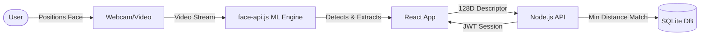
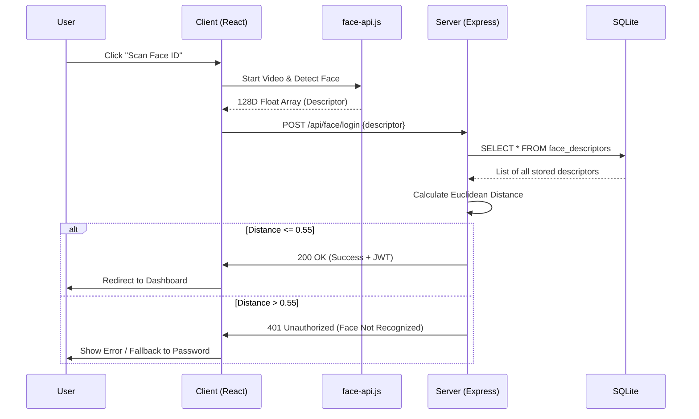
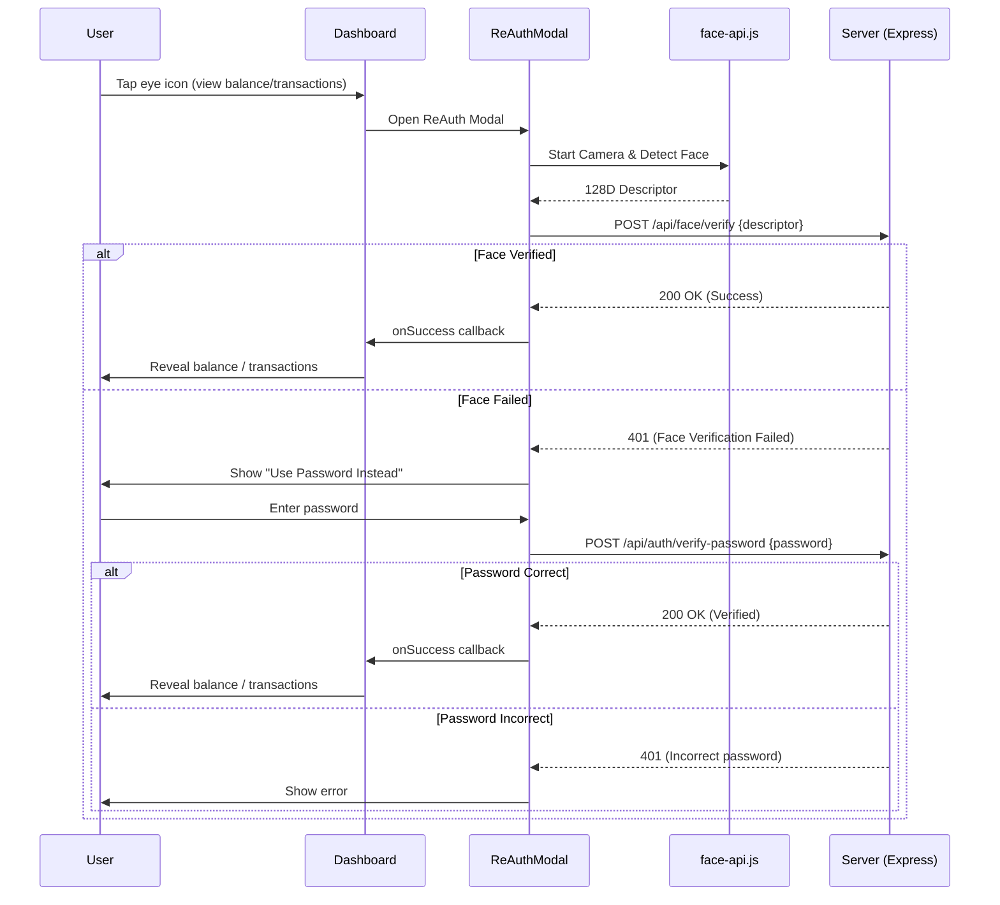
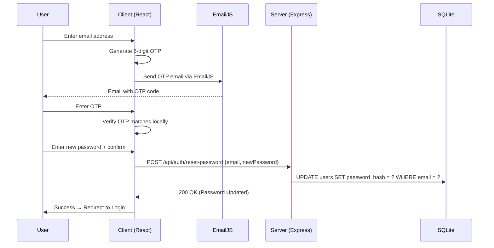
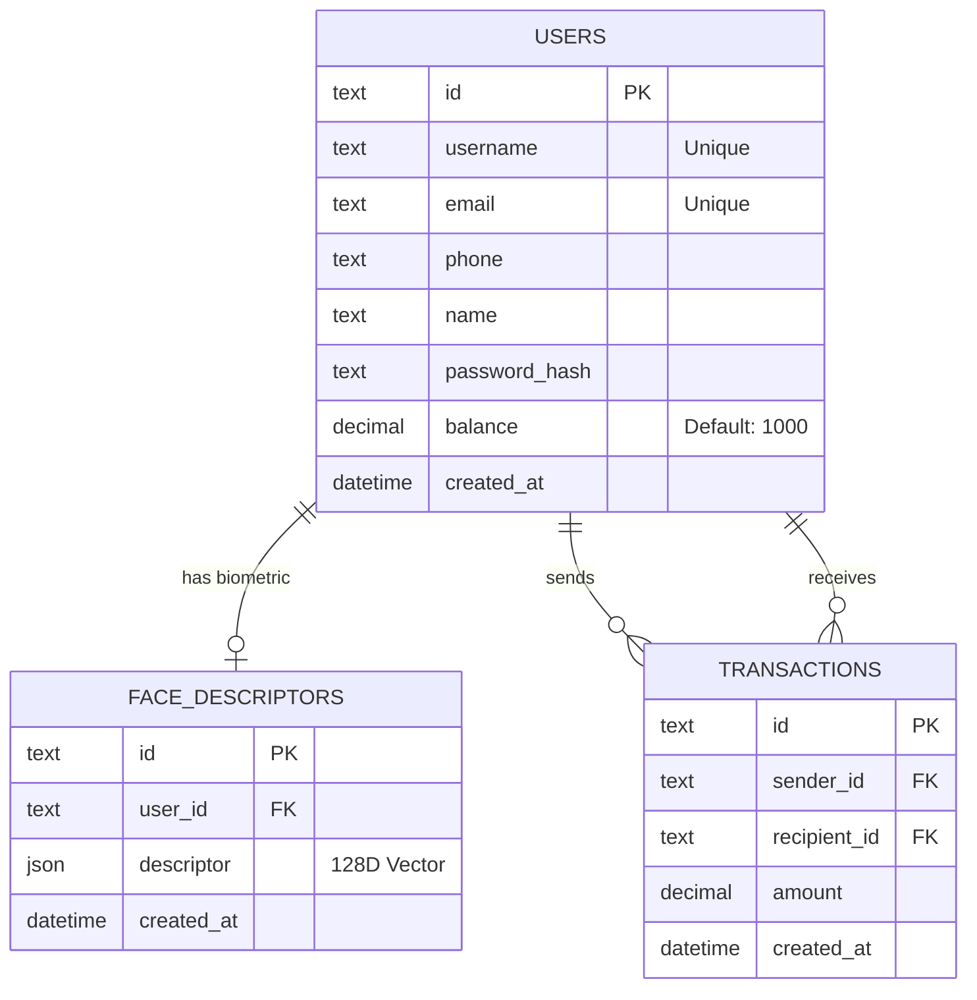

# FaceWallet

> A next-generation digital wallet secured by real-time AI face recognition — no passwords required.


---

## What is FaceWallet?

FaceWallet is a **biometric-first digital wallet** that authenticates users using their face via machine learning, eliminating the need to remember passwords. It combines a sleek React frontend with a Node.js backend and a real ML face recognition engine powered by `face-api.js`.

Every sensitive action — from viewing your balance to sending money — is protected by real-time face verification with an automatic password fallback.

---

## Features

### Authentication & Security
| Feature | Description |
|---|---|
| **Face ID Registration** | Capture and store a 128-dimensional face descriptor using your webcam |
| **Face ID Login** | Authenticate instantly by scanning your face — matched via Euclidean distance |
| **Password Registration** | Classic username + email + password sign-up with bcrypt hashing |
| **Password Login** | Traditional fallback login with JWT session management |
| **Session Persistence** | Automatically restores your session via HttpOnly cookie on page reload |
| **Secure Logout** | Clears server-side JWT cookie |
| **Re-Authentication for Sensitive Data** | Balance and transactions are hidden by default — viewing requires Face ID re-verification |
| **Password Fallback on Re-Auth** | If Face ID fails during re-authentication, the user can verify with their account password instead |
| **Suspicious Login Alerts** | After 3 failed password login attempts, a security alert email is sent to the user's registered email via EmailJS |
| **Forgot Password (OTP Flow)** | 4-step password reset: enter email → receive OTP via EmailJS → verify OTP → set new password |
| **OTP Email Delivery** | OTP codes are sent via EmailJS (configurable service, template, and public key) |

### Wallet & Payments
| Feature | Description |
|---|---|
| **Hidden Balance by Default** | Balance displays as `••••••` with a lock icon — tapping the eye icon triggers Face ID re-verification |
| **Hidden Transactions by Default** | Transaction history is hidden behind a shield — requires Face ID verification to reveal |
| **Independent Auth States** | Balance and transactions have separate authentication states — unlock one without unlocking the other |
| **Re-Lock on Hide** | Toggling balance or transactions back to hidden resets the auth state, requiring re-verification to view again |
| **Send Money** | Transfer funds to other users — select a contact, enter an amount, then verify with Face ID before each payment |
| **Face-Verified Payments** | Every payment requires real-time face re-verification via `POST /api/face/verify` — the transfer is blocked unless the face matches |
| **Password Fallback for Payments** | If face scan fails during a payment, the user can enter their password to authorize the transfer instead |
| **Quick Amount Buttons** | Pre-set +₹50, +₹100, +₹200, +₹500 buttons for fast amount entry |
| **Contact Search** | Search registered contacts when sending money |
| **Transaction History** | Full list of sent and received transactions with status, amount, date, and counterparty |
| **Transaction Success Screen** | Animated success confirmation with amount and recipient details |

### Profile Management
| Feature | Description |
|---|---|
| **View Profile** | Displays full name, username, email, and phone with gradient avatar |
| **Edit Profile** | Inline editing for name, email, and phone with real-time validation |
| **Email Validation** | Regex-based email format validation on both frontend and backend |
| **Phone Validation** | Exactly 10-digit phone number enforcement with live character counter |
| **Unique Email Enforcement** | Backend rejects updates if the email is already used by another account |
| **Delete All Data** | Danger zone: type `DELETE` to confirm irreversible deletion of all users, face data, and transactions |

### Robustness & Engineering
| Feature | Description |
|---|---|
| **Graceful Shutdown** | Server handles SIGTERM/SIGINT and closes DB connections cleanly |
| **DB Init Safety** | Server waits for database schema initialization before accepting requests |
| **Atomic Transfers** | Money transfers use `BEGIN TRANSACTION` / `COMMIT` / `ROLLBACK` with atomic SQL updates to prevent double-spend race conditions |
| **Busy Timeout** | SQLite configured with 3s busy timeout to handle concurrent access |
| **Fetch Abort on Unmount** | Dashboard cancels in-flight requests when component unmounts |
| **Timer Cleanup** | All `setTimeout` calls are cleaned up on component unmount to prevent memory leaks |
| **Camera Cleanup** | All camera streams are properly stopped when modals close or components unmount |
| **Configurable API URL** | Backend URL extracted to `VITE_API_URL` env var (defaults to `localhost:5000`) |
| **Input Validation** | Face descriptors validated for 128 finite numbers; transfer amounts sanitized to 2 decimal places |
| **Self-Transfer Prevention** | Backend blocks users from sending money to themselves |

---

## Architecture

```
face_login/
├── frontend/                 # React + Vite + Tailwind CSS v4
│   └── src/
│       ├── main.tsx                    # App entry point
│       ├── utils/
│       │   └── email-service.ts       # EmailJS: OTP, password reset, suspicious login alerts
│       └── app/
│           ├── config.ts              # API_BASE URL configuration
│           ├── App.tsx                # App state machine (routing)
│           └── components/
│               ├── RegistrationStart.tsx     # Landing page (Face ID / Traditional choice)
│               ├── FaceAuth.tsx              # Face ID login flow
│               ├── FaceRegistration.tsx      # Webcam face capture for registration
│               ├── FaceRegistrationInfo.tsx  # User info form (face-based registration)
│               ├── TraditionalLogin.tsx      # Username/password login
│               ├── TraditionalRegistration.tsx # Email/password registration
│               ├── ForgotPassword.tsx        # 4-step OTP password reset flow
│               ├── Dashboard.tsx             # Wallet dashboard (hidden balance + transactions)
│               ├── ReAuthModal.tsx           # Re-authentication modal (Face ID + password fallback)
│               ├── SendMoney.tsx             # Send money with face verification
│               ├── TransactionHistory.tsx    # Full transaction history list
│               ├── Profile.tsx              # Profile view/edit + danger zone
│               └── ui/                      # Reusable UI primitives (Button, Input)
│
└── backend/                  # Node.js + Express 5
    ├── server.js             # Entry point with graceful shutdown
    ├── routes/
    │   ├── auth.js           # /api/auth — login, logout, /me, verify-password, reset-password
    │   ├── register.js       # /api/register — user creation (traditional)
    │   ├── face.js           # /api/face — face register, login, verify
    │   ├── wallet.js         # /api/wallet — balance, history, transfer
    │   ├── user.js           # /api/users — contacts list, profile CRUD
    │   └── admin.js          # /api/admin — clear all data (danger zone)
    ├── middleware/
    │   └── auth.js           # JWT authentication middleware
    ├── db/
    │   ├── index.js          # SQLite connection with busyTimeout + init promise
    │   └── schema.sql        # users + face_descriptors + transactions tables
    ├── scripts/
    │   └── seed_mock_users.js # Seed test users for development
    ├── Dockerfile
    └── docker-compose.yml
```

---

## System Diagrams

### 1. Data Flow Diagram (DFD)


```mermaid
graph LR
    User([User])
    Webcam[Webcam/Video]
    ML_Model[face-api.js ML Engine]
    Frontend[React App]
    Backend[Node.js API]
    DB[(SQLite DB)]

    User -- "Positions Face" --> Webcam
    Webcam -- "Video Stream" --> ML_Model
    ML_Model -- "Detects & Extracts" --> Frontend
    Frontend -- "128D Descriptor" --> Backend
    Backend -- "Min Distance Match" --> DB
    Backend -- "JWT Session" --> Frontend
```

### 2. Face ID Authentication Sequence


```mermaid
sequenceDiagram
    participant U as User
    participant C as Client (React)
    participant ML as face-api.js
    participant S as Server (Express)
    participant DB as SQLite

    U->>C: Click "Scan Face ID"
    C->>ML: Start Video & Detect Face
    ML-->>C: 128D Float Array (Descriptor)
    C->>S: POST /api/face/login {descriptor}
    S->>DB: SELECT * FROM face_descriptors
    DB-->>S: List of all stored descriptors
    S->>S: Calculate Euclidean Distance
    alt Distance <= 0.55
        S->>C: 200 OK (Success + JWT)
        C->>U: Redirect to Dashboard
    else Distance > 0.55
        S->>C: 401 Unauthorized (Face Not Recognized)
        C->>U: Show Error / Fallback to Password
    end
```

### 3. Re-Authentication Flow (Balance/Transactions)


```mermaid
sequenceDiagram
    participant U as User
    participant D as Dashboard
    participant M as ReAuthModal
    participant ML as face-api.js
    participant S as Server (Express)

    U->>D: Tap eye icon (view balance/transactions)
    D->>M: Open ReAuth Modal
    M->>ML: Start Camera & Detect Face
    ML-->>M: 128D Descriptor
    M->>S: POST /api/face/verify {descriptor}
    alt Face Verified
        S-->>M: 200 OK (Success)
        M->>D: onSuccess callback
        D->>U: Reveal balance / transactions
    else Face Failed
        S-->>M: 401 (Face Verification Failed)
        M->>U: Show "Use Password Instead"
        U->>M: Enter password
        M->>S: POST /api/auth/verify-password {password}
        alt Password Correct
            S-->>M: 200 OK (Verified)
            M->>D: onSuccess callback
            D->>U: Reveal balance / transactions
        else Password Incorrect
            S-->>M: 401 (Incorrect password)
            M->>U: Show error
        end
    end
```

### 4. Face-Verified Payment Sequence


```mermaid
sequenceDiagram
    participant U as User
    participant C as Client (React)
    participant ML as face-api.js
    participant S as Server (Express)
    participant DB as SQLite

    U->>C: Click "Verify with Face ID & Send"
    C->>C: Open Camera & Load ML Models
    U->>C: Click "Scan & Verify"
    C->>ML: Detect Face from Video
    ML-->>C: 128D Descriptor
    C->>S: POST /api/face/verify {descriptor}
    S->>DB: SELECT descriptor FROM face_descriptors WHERE user_id = ?
    DB-->>S: Logged-in user's descriptors only
    S->>S: Euclidean Distance Check
    alt Distance <= 0.55
        S-->>C: 200 OK (Face Verified)
        C->>S: POST /api/wallet/transfer {contactName, amount}
        S->>DB: Atomic deduct + credit + record
        S-->>C: 200 OK (Transaction Success)
        C->>U: Show Success Screen
    else Distance > 0.55
        S-->>C: 401 (Face Verification Failed)
        C->>U: Show Error + "Use Password Instead"
        U->>C: Enter password
        C->>S: POST /api/auth/verify-password {password}
        alt Password Correct
            S-->>C: 200 OK
            C->>S: POST /api/wallet/transfer {contactName, amount}
            S->>DB: Atomic deduct + credit + record
            S-->>C: 200 OK (Transaction Success)
            C->>U: Show Success Screen
        else Password Incorrect
            S-->>C: 401 (Incorrect)
            C->>U: Show Error
        end
    end
```

### 5. Forgot Password (OTP) Sequence


```mermaid
sequenceDiagram
    participant U as User
    participant C as Client (React)
    participant E as EmailJS
    participant S as Server (Express)
    participant DB as SQLite

    U->>C: Enter email address
    C->>C: Generate 6-digit OTP
    C->>E: Send OTP email via EmailJS
    E-->>U: Email with OTP code
    U->>C: Enter OTP
    C->>C: Verify OTP matches locally
    U->>C: Enter new password + confirm
    C->>S: POST /api/auth/reset-password {email, newPassword}
    S->>DB: UPDATE users SET password_hash = ? WHERE email = ?
    S-->>C: 200 OK (Password Updated)
    C->>U: Success → Redirect to Login
```

### 6. Entity Relationship Diagram (ERD)


```mermaid
erDiagram
    USERS {
        text id PK
        text username "Unique"
        text email "Unique"
        text phone
        text name
        text password_hash
        decimal balance "Default: 1000"
        datetime created_at
    }
    FACE_DESCRIPTORS {
        text id PK
        text user_id FK
        json descriptor "128D Vector"
        datetime created_at
    }
    TRANSACTIONS {
        text id PK
        text sender_id FK
        text recipient_id FK
        decimal amount
        datetime created_at
    }
    USERS ||--o| FACE_DESCRIPTORS : "has biometric"
    USERS ||--o{ TRANSACTIONS : "sends"
    USERS ||--o{ TRANSACTIONS : "receives"
```

---

## How Face Recognition Works

1. **Registration**: The browser uses `face-api.js` to detect your face via webcam and computes a **128-dimensional face descriptor** (a floating-point vector unique to your face). Each value is validated to be a finite number.
2. **Storage**: The descriptor is sent to the backend and stored in the `face_descriptors` table linked to your user account.
3. **Login**: During authentication, a new descriptor is captured and compared against all stored descriptors using **Euclidean distance**.
4. **Match decision**: If the closest match has a distance <= `0.55` (configurable threshold), login succeeds and a JWT is issued.
5. **Re-Authentication**: When viewing sensitive data (balance, transactions) or sending money, the user must scan their face again. The descriptor is compared only against the logged-in user's stored face data via `POST /api/face/verify`.
6. **Password Fallback**: If face verification fails at any re-auth point, the user can enter their password instead — verified via `POST /api/auth/verify-password`.

> The SSD MobileNet v1 + FaceLandmark68Net + FaceRecognitionNet models are loaded from the `/models` directory in the frontend's public folder.

---

## Application Screens

| Screen | Description |
|---|---|
| **Landing Page** | Choose between Face ID registration, traditional registration, Face ID login, or password login |
| **Face Registration** | Webcam capture with face detection frame, scanning animation, and progress bar |
| **Registration Info** | Enter full name, username, email, phone, and optional password after face capture |
| **Traditional Registration** | Full form with email, phone, username, password, and bcrypt hashing |
| **Face ID Login** | Scan your face to authenticate — fallback to password on failure |
| **Traditional Login** | Username/password login with suspicious activity alerting |
| **Forgot Password** | 4-step wizard: Email → OTP → New Password → Done (with step indicators) |
| **Dashboard** | Wallet overview with hidden balance, quick actions, and hidden transactions |
| **ReAuth Modal** | Face ID verification overlay with password fallback (used for balance + transactions) |
| **Send Money** | Contact selection, amount input, face verification, and success confirmation |
| **Transaction History** | Full chronological list of all sent/received transactions |
| **Profile** | View/edit personal info + danger zone to delete all data |

---

## Tech Stack

### Frontend
| Tech | Purpose |
|---|---|
| **React 18** + **Vite** | UI framework & build tool |
| **TypeScript** | Type safety |
| **Tailwind CSS v4** | Utility-first styling |
| **face-api.js** | Browser-based ML face detection & recognition |
| **Motion (Framer Motion)** | Animations & transitions |
| **Radix UI** | Accessible UI primitives |
| **Lucide React** | Icon library |
| **EmailJS** | Client-side email delivery (OTP, alerts) |

### Backend
| Tech | Purpose |
|---|---|
| **Node.js 20** + **Express 5** | API server |
| **SQLite3** | Lightweight persistent database |
| **bcrypt** | Password hashing |
| **jsonwebtoken** | JWT authentication |
| **cookie-parser** | HttpOnly cookie management |

---

## Local Setup

### Prerequisites
- **Node.js** >= 20
- **npm** or **pnpm**
- A webcam (for face registration/login)

### 1. Clone the repository
```bash
git clone https://github.com/your-username/face_login.git
cd face_login
```

### 2. Set up the Backend
```bash
cd backend

# Create environment file
cp .env.example .env
# Edit .env and set your JWT_SECRET and FRONTEND_URL

# Install dependencies
npm install

# Start the server (waits for DB init, then listens)
node server.js
# Server runs on http://localhost:5000
```

### 3. Seed Mock Users (optional)
```bash
cd backend
node scripts/seed_mock_users.js
```

This creates 4 test users you can send money to:

| Name | Username | Balance |
|---|---|---|
| Sarah Wilson | sarah_w | ₹1,000 |
| James Chen | james_c | ₹1,000 |
| Elena Rodriguez | elena_r | ₹1,000 |
| Marcus Thorne | marcus_t | ₹1,000 |

### 4. Set up the Frontend
```bash
cd frontend

# Install dependencies
npm install   # or: pnpm install

# Start the dev server
npm run dev
# App runs on http://localhost:5173
```

---

## Docker (Backend)

Run the backend fully containerized with a single command:

```bash
cd backend
docker compose up --build
```

This will:
- Build the Node.js image from `Dockerfile` (Node 20 Alpine)
- Mount `./db` as a volume to persist your SQLite database
- Expose port `5000`

---

## API Reference

### Auth — `/api/auth`
| Method | Endpoint | Auth | Description |
|---|---|---|---|
| `POST` | `/login` | ✗ | Username + password login → returns JWT cookie |
| `GET` | `/me` | ✗ | Get currently logged-in user from JWT cookie |
| `POST` | `/logout` | ✗ | Clear session cookie |
| `POST` | `/verify-password` | ✓ | Verify logged-in user's password (re-auth fallback) |
| `POST` | `/reset-password` | ✗ | Reset password by email (after OTP verification) |

### Registration — `/api/register`
| Method | Endpoint | Auth | Description |
|---|---|---|---|
| `POST` | `/` | ✗ | Create a new user account (traditional registration) |

### Face — `/api/face`
| Method | Endpoint | Auth | Description |
|---|---|---|---|
| `POST` | `/register` | ✗ | Store a 128D face descriptor + create user account |
| `POST` | `/login` | ✗ | Authenticate via face descriptor → returns JWT cookie |
| `POST` | `/verify` | ✓ | Verify face matches logged-in user (re-auth for payments, balance, transactions) |

### Wallet — `/api/wallet`
| Method | Endpoint | Auth | Description |
|---|---|---|---|
| `GET` | `/balance` | ✓ | Get current balance |
| `GET` | `/history` | ✓ | Get transaction history (sent + received) |
| `POST` | `/transfer` | ✓ | Send money to another user (atomic SQL transaction) |

### Users — `/api/users`
| Method | Endpoint | Auth | Description |
|---|---|---|---|
| `GET` | `/contacts` | ✓ | Get list of other users for transfers |
| `GET` | `/profile` | ✓ | Get logged-in user's full profile |
| `PUT` | `/profile` | ✓ | Update name, email, phone for logged-in user |

### Admin — `/api/admin`
| Method | Endpoint | Auth | Description |
|---|---|---|---|
| `DELETE` | `/clear-data` | ✗ | Delete ALL users, face descriptors, and transactions |

---

## Database Schema

```sql
CREATE TABLE users (
  id            TEXT PRIMARY KEY,
  username      TEXT UNIQUE NOT NULL,
  email         TEXT UNIQUE,
  phone         TEXT,
  name          TEXT NOT NULL,
  password_hash TEXT,
  balance       DECIMAL DEFAULT 1000.00,
  created_at    DATETIME DEFAULT CURRENT_TIMESTAMP
);

CREATE TABLE face_descriptors (
  id          TEXT PRIMARY KEY,
  user_id     TEXT NOT NULL REFERENCES users(id) ON DELETE CASCADE,
  descriptor  JSON NOT NULL,   -- 128-element float array
  created_at  DATETIME DEFAULT CURRENT_TIMESTAMP
);

CREATE TABLE transactions (
  id            TEXT PRIMARY KEY,
  sender_id     TEXT NOT NULL REFERENCES users(id),
  recipient_id  TEXT NOT NULL REFERENCES users(id),
  amount        DECIMAL NOT NULL,
  created_at    DATETIME DEFAULT CURRENT_TIMESTAMP
);
```

---

## Security Notes

- **Password hashing**: Passwords are hashed with **bcrypt** — never stored in plain text.
- **Face-only users**: Face-only users have `null` password_hash — bcrypt is safely skipped for them.
- **HttpOnly cookies**: Session tokens are stored in **HttpOnly cookies** — not accessible from JavaScript.
- **No image storage**: Face descriptors are mathematical vectors; the original image is never stored or transmitted.
- **JWT expiry**: JWT tokens expire after **24 hours**.
- **Tight threshold**: The `DISTANCE_THRESHOLD` of `0.55` offers tight matching for liveness accuracy (typical `face-api.js` default is 0.6).
- **Atomic transfers**: Money transfers use `BEGIN TRANSACTION` / `COMMIT` / `ROLLBACK` SQL operations to prevent race conditions and double-spending.
- **Re-authentication**: Viewing balance and transactions requires Face ID re-verification (or password fallback) — data is hidden by default on dashboard load.
- **Payment verification**: Every payment requires real-time face re-verification — the face descriptor is checked against only the logged-in user's stored data, preventing unauthorized transfers even with a valid session. Password fallback is available if face scan fails.
- **Suspicious login alerting**: After 3 consecutive failed password login attempts, a security alert email is automatically sent to the user's registered email address.
- **Self-transfer blocked**: The backend prevents users from transferring money to themselves.
- **Amount sanitization**: Transfer amounts are rounded to 2 decimal places and validated for finite positive numbers.

---

## Environment Variables

### `backend/.env`
```env
PORT=5000
JWT_SECRET=your-super-secret-key-here
FRONTEND_URL=http://localhost:5173
NODE_ENV=development
```

### `frontend/.env` (optional)
```env
VITE_API_URL=http://localhost:5000
VITE_EMAILJS_SERVICE_ID=your_service_id
VITE_EMAILJS_TEMPLATE_ID=your_template_id
VITE_EMAILJS_PUBLIC_KEY=your_public_key
```

---

## License

This project is open source and available under the [MIT License](LICENSE).
